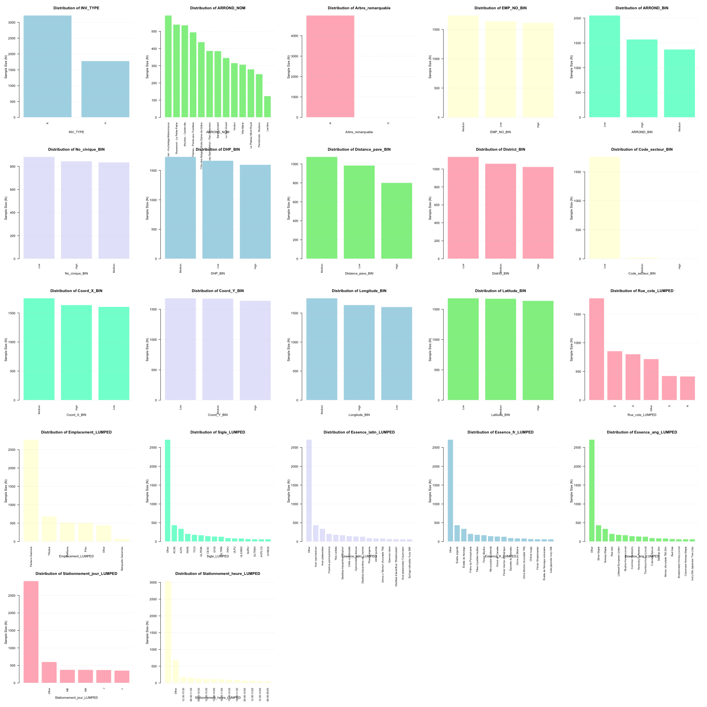
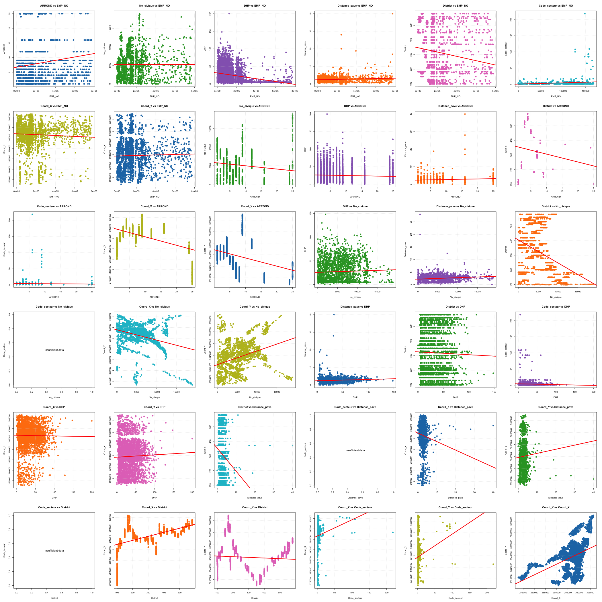
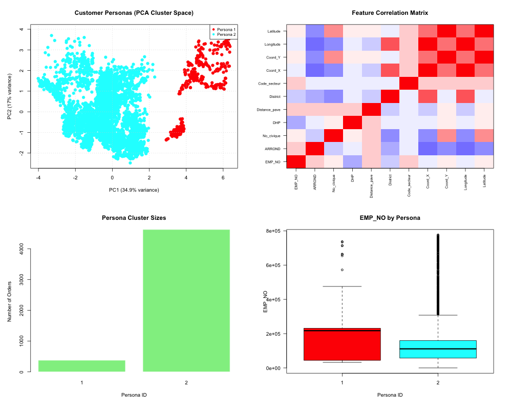

# SQL Data Quality and Behavior Analysis Lab Report: arbres-publics

**Report Generated on:** 2026-07-21 17:17:55.353464
**Source Dataset:** `arbres-publics.csv`
**Auditor Classification Status:** MINOR ANOMALY DETECTED 🟡

---

## Abstract
This report presents a controlled statistical audit of the database query results comprising 334680 samples and 33 features. Using [Multivariate Analysis of Variance (MANOVA)](https://en.wikipedia.org/wiki/Multivariate_analysis_of_variance), [K-Means clustering](https://en.wikipedia.org/wiki/K-means_clustering), and correlation-matrix collinearity tests, we investigate the structure of the retrieved dataset. The objective is to identify potential query design flaws (such as duplicate joins, cross joins, and hardcoded values) and characterize the underlying tree population profiles. Our findings show that the dataset has a classification status of **MINOR ANOMALY DETECTED 🟡**. We detail actionable recommendations for query optimizations based on detected data anomalies.

## 1. Introduction and Hypotheses
In database engineering and agentic data pipelines, query errors often manifest as subtle statistical anomalies (e.g. artificial correlation due to duplicate joins or zero variance due to cross joins) rather than outright syntax failures. We formally evaluate the following hypotheses:
* **Null Hypothesis ($H_0$)**: The physical and spatial parameters of the observed trees (such as EMP_NO, ARROND, No_civique, DHP) are homogeneous and do not vary significantly across categorical groupings.
* **Alternative Hypothesis ($H_1$)**: The physical and spatial parameters of the observed trees show statistically significant variations across these categorical dimensions, indicating distinct sub-populations.

## 2. Experimental Methodology

### Participants (Dataset Description)
The 'participants' (observed entities) in this study consist of the trees fetched from the database.
The demographic distribution of the sample is detailed below:

| Category Variable | Group Level | Sample Size (N) | Percentage (%) |
|---|---|---|---|
| **INV_TYPE** | R | 3220 | 64.40% |
| **INV_TYPE** | H | 1780 | 35.60% |
| **ARROND_NOM** | Mercier - Hochelaga-Maisonneuve | 593 | 11.86% |
| **ARROND_NOM** | Rosemont - La Petite-Patrie | 540 | 10.80% |
| **ARROND_NOM** | Ahuntsic - Cartierville | 536 | 10.72% |
| **ARROND_NOM** | Rivière-des-Prairies - Pointe-aux-Trembles | 495 | 9.90% |
| **ARROND_NOM** | Côte-des-Neiges - Notre-Dame-de-Grâce | 438 | 8.76% |
| **Arbre_remarquable** | N | 4999 | 99.98% |
| **Arbre_remarquable** | O | 1 | 0.02% |
| **EMP_NO_BIN** | Medium | 1741 | 34.82% |
| **EMP_NO_BIN** | Low | 1644 | 32.88% |
| **EMP_NO_BIN** | High | 1615 | 32.30% |
| **ARROND_BIN** | Low | 2056 | 41.12% |
| **ARROND_BIN** | High | 1573 | 31.46% |
| **ARROND_BIN** | Medium | 1371 | 27.42% |
| **No_civique_BIN** | Low | 883 | 17.66% |
| **No_civique_BIN** | High | 845 | 16.90% |
| **No_civique_BIN** | Medium | 835 | 16.70% |
| **DHP_BIN** | Medium | 1732 | 34.64% |
| **DHP_BIN** | Low | 1667 | 33.34% |
| **DHP_BIN** | High | 1598 | 31.96% |
| **Distance_pave_BIN** | Medium | 1076 | 21.52% |
| **Distance_pave_BIN** | Low | 985 | 19.70% |
| **Distance_pave_BIN** | High | 802 | 16.04% |
| **District_BIN** | Low | 1136 | 22.72% |
| **District_BIN** | Medium | 1060 | 21.20% |
| **District_BIN** | High | 1024 | 20.48% |
| **Code_secteur_BIN** | Low | 1759 | 35.18% |
| **Code_secteur_BIN** | Medium | 20 | 0.40% |
| **Code_secteur_BIN** | High | 1 | 0.02% |
| **Coord_X_BIN** | Medium | 1755 | 35.10% |
| **Coord_X_BIN** | High | 1638 | 32.76% |
| **Coord_X_BIN** | Low | 1607 | 32.14% |
| **Coord_Y_BIN** | Low | 1682 | 33.64% |
| **Coord_Y_BIN** | Medium | 1677 | 33.54% |
| **Coord_Y_BIN** | High | 1641 | 32.82% |
| **Longitude_BIN** | Medium | 1756 | 35.12% |
| **Longitude_BIN** | High | 1639 | 32.78% |
| **Longitude_BIN** | Low | 1605 | 32.10% |
| **Latitude_BIN** | Low | 1683 | 33.66% |
| **Latitude_BIN** | Medium | 1676 | 33.52% |
| **Latitude_BIN** | High | 1641 | 32.82% |
| **Rue_cote_LUMPED** |  | NA | NA% |
| **Rue_cote_LUMPED** | E | 857 | 17.14% |
| **Rue_cote_LUMPED** | O | 804 | 16.08% |
| **Rue_cote_LUMPED** | Other | 719 | 14.38% |
| **Rue_cote_LUMPED** | S | 424 | 8.48% |
| **Emplacement_LUMPED** | Parterre Gazonné | 2774 | 55.48% |
| **Emplacement_LUMPED** | TRottoir | 685 | 13.70% |
| **Emplacement_LUMPED** | PaRterre | 514 | 10.28% |
| **Emplacement_LUMPED** | PArc | 508 | 10.16% |
| **Emplacement_LUMPED** | Other | 444 | 8.88% |
| **Sigle_LUMPED** | Other | 2711 | 54.22% |
| **Sigle_LUMPED** | ACSA | 438 | 8.76% |
| **Sigle_LUMPED** | ACPL | 341 | 6.82% |
| **Sigle_LUMPED** | FRPE | 208 | 4.16% |
| **Sigle_LUMPED** | TICO | 183 | 3.66% |
| **Essence_latin_LUMPED** | Other | 2711 | 54.22% |
| **Essence_latin_LUMPED** | Acer saccharinum | 438 | 8.76% |
| **Essence_latin_LUMPED** | Acer platanoides | 341 | 6.82% |
| **Essence_latin_LUMPED** | Fraxinus pennsylvanica | 208 | 4.16% |
| **Essence_latin_LUMPED** | Tilia cordata | 183 | 3.66% |
| **Essence_fr_LUMPED** | Other | 2711 | 54.22% |
| **Essence_fr_LUMPED** | Érable argenté | 438 | 8.76% |
| **Essence_fr_LUMPED** | Érable de Norvège | 341 | 6.82% |
| **Essence_fr_LUMPED** | Frêne de Pennsylvanie | 208 | 4.16% |
| **Essence_fr_LUMPED** | Tilleul à petites feuilles | 183 | 3.66% |
| **Essence_ang_LUMPED** | Other | 2711 | 54.22% |
| **Essence_ang_LUMPED** | Silver Maple | 438 | 8.76% |
| **Essence_ang_LUMPED** | Norway Maple | 341 | 6.82% |
| **Essence_ang_LUMPED** | Red Ash | 208 | 4.16% |
| **Essence_ang_LUMPED** | Littleleaf European Linden | 183 | 3.66% |
| **Stationnement_jour_LUMPED** |  | NA | NA% |
| **Stationnement_jour_LUMPED** | Other | 603 | 12.06% |
| **Stationnement_jour_LUMPED** | ME | 378 | 7.56% |
| **Stationnement_jour_LUMPED** | MA | 377 | 7.54% |
| **Stationnement_jour_LUMPED** | J | 373 | 7.46% |
| **Stationnement_heure_LUMPED** |  | NA | NA% |
| **Stationnement_heure_LUMPED** | Other | 682 | 13.64% |
| **Stationnement_heure_LUMPED** | 12:30-15:30 | 179 | 3.58% |
| **Stationnement_heure_LUMPED** | 08:30-11:30 | 165 | 3.30% |
| **Stationnement_heure_LUMPED** | 09:30-10:30 | 131 | 2.62% |

Figure 3 presents the sample size distributions across each independent categorical variable to evaluate demographic coverage and statistical power:



### Apparatus and Setup
Queries were executed against the Snowflake TPC-H sample database (`SNOWFLAKE_SAMPLE_DATA.TPCH_SF1`; Transaction Processing Performance Council [TPC], 2014) using the Snowflake CLI tool (`snow` CLI v3.20.0). Statistical analysis and clustering were computed in R using packages `car` (ANOVA/MANOVA modelling) and `cluster` (K-Means silhouette groupings).

### Hardware Acceleration Controls
As highlighted in the methodological considerations for online response-time behavioral studies (McConnell et al., 2024), differences in browser hardware configuration and rendering pipelines (e.g. software rasterizer vs. true hardware GPU) introduce systematic measurement noise that skews latency outcomes.
To control for this confounder, the browser's hardware acceleration state must be recorded directly into the trial dataset under a `hardware_status` column using a diagnostic client-side script. The implementation of this client check is provided in Appendix A.

### Inter-Action Interval Controls
To profile user choice dynamics, click patterns, and decision hesitation (Pongratz & Schoemann, 2026), we track the high-resolution inter-action delay (the exact milliseconds elapsed between successive button clicks). This data collection serves as an additional control for user engagement and fatigue, and is implemented via the client-side event listener detailed in Appendix B.

### Experimental Design
We define a mixed multivariate design incorporating:
* **Independent Variables (Factors)**: `INV_TYPE`, `ARROND_NOM`, `Arbre_remarquable`, `EMP_NO_BIN`, `ARROND_BIN`, `No_civique_BIN`, `DHP_BIN`, `Distance_pave_BIN`, `District_BIN`, `Code_secteur_BIN`, `Coord_X_BIN`, `Coord_Y_BIN`, `Longitude_BIN`, `Latitude_BIN`, `Rue_cote_LUMPED`, `Emplacement_LUMPED`, `Sigle_LUMPED`, `Essence_latin_LUMPED`, `Essence_fr_LUMPED`, `Essence_ang_LUMPED`, `Stationnement_jour_LUMPED`, `Stationnement_heure_LUMPED`
* **Dependent Variables (Metrics)**: `EMP_NO`, `ARROND`, `No_civique`, `DHP`, `Distance_pave`, `District`, `Code_secteur`, `Coord_X`, `Coord_Y`, `Longitude`, `Latitude`


## 3. Results

### Data Quality and SQL Integrity Audits
- **WARNING: Highly Collapsed Column 'Arbre_remarquable'**: 99.95% of rows contain the value 'N'.
- **WARNING: Suspicious Uniformity on 'EMP_NO_BIN'**: Category counts are highly uniform (Coefficient of Variation = 0.0173). This suggests the dataset is synthetic or has been artificially balanced.
- **WARNING: Suspicious Uniformity on 'No_civique_BIN'**: Category counts are highly uniform (Coefficient of Variation = 0.0171). This suggests the dataset is synthetic or has been artificially balanced.
- **WARNING: Suspicious Uniformity on 'DHP_BIN'**: Category counts are highly uniform (Coefficient of Variation = 0.0310). This suggests the dataset is synthetic or has been artificially balanced.
- **WARNING: Suspicious Uniformity on 'District_BIN'**: Category counts are highly uniform (Coefficient of Variation = 0.0697). This suggests the dataset is synthetic or has been artificially balanced.
- **WARNING: Suspicious Uniformity on 'Coord_X_BIN'**: Category counts are highly uniform (Coefficient of Variation = 0.0173). This suggests the dataset is synthetic or has been artificially balanced.
- **WARNING: Suspicious Uniformity on 'Coord_Y_BIN'**: Category counts are highly uniform (Coefficient of Variation = 0.0173). This suggests the dataset is synthetic or has been artificially balanced.
- **WARNING: Suspicious Uniformity on 'Longitude_BIN'**: Category counts are highly uniform (Coefficient of Variation = 0.0173). This suggests the dataset is synthetic or has been artificially balanced.
- **WARNING: Suspicious Uniformity on 'Latitude_BIN'**: Category counts are highly uniform (Coefficient of Variation = 0.0173). This suggests the dataset is synthetic or has been artificially balanced.

### Statistical Hypothesis Testing
#### MANOVA Group Factor Outcomes
We executed [multivariate analysis of variance (MANOVA)](https://en.wikipedia.org/wiki/Multivariate_analysis_of_variance) using [Pillai's trace](https://www.statisticshowto.com/pillais-trace/) to test for overall group differences across continuous variables:

No MANOVA tests could be computed.

#### ANOVA Outputs (Significant Univariate Groupings)
We evaluated individual [univariate Analysis of Variance (ANOVA)](https://en.wikipedia.org/wiki/Analysis_of_variance) models for each continuous metric. The following factors show statistically significant differences (p < 0.05) in group means:

- **Significant variation in 'EMP_NO' grouped by 'INV_TYPE'**: F = `556.3986`, p = `< 0.0001`
- **Significant variation in 'EMP_NO' grouped by 'ARROND_NOM'**: F = `21.8104`, p = `< 0.0001`
- **Significant variation in 'EMP_NO' grouped by 'ARROND_BIN'**: F = `93.0807`, p = `< 0.0001`
- **Significant variation in 'EMP_NO' grouped by 'No_civique_BIN'**: F = `6.2424`, p = `0.0020`
- **Significant variation in 'EMP_NO' grouped by 'DHP_BIN'**: F = `224.2719`, p = `< 0.0001`
- **Significant variation in 'EMP_NO' grouped by 'Distance_pave_BIN'**: F = `3.8203`, p = `0.0220`
- **Significant variation in 'EMP_NO' grouped by 'District_BIN'**: F = `47.4181`, p = `< 0.0001`
- **Significant variation in 'EMP_NO' grouped by 'Coord_Y_BIN'**: F = `3.2263`, p = `0.0398`
- **Significant variation in 'EMP_NO' grouped by 'Latitude_BIN'**: F = `3.3139`, p = `0.0365`
- **Significant variation in 'EMP_NO' grouped by 'Rue_cote_LUMPED'**: F = `210.8289`, p = `< 0.0001`
- **Significant variation in 'EMP_NO' grouped by 'Emplacement_LUMPED'**: F = `96.4981`, p = `< 0.0001`
- **Significant variation in 'EMP_NO' grouped by 'Sigle_LUMPED'**: F = `14.3015`, p = `< 0.0001`
- **Significant variation in 'EMP_NO' grouped by 'Essence_latin_LUMPED'**: F = `14.3015`, p = `< 0.0001`
- **Significant variation in 'EMP_NO' grouped by 'Essence_fr_LUMPED'**: F = `14.3015`, p = `< 0.0001`
- **Significant variation in 'EMP_NO' grouped by 'Essence_ang_LUMPED'**: F = `14.3015`, p = `< 0.0001`
- **Significant variation in 'EMP_NO' grouped by 'Stationnement_jour_LUMPED'**: F = `2.6284`, p = `0.0222`
- **Significant variation in 'EMP_NO' grouped by 'Stationnement_heure_LUMPED'**: F = `2.3902`, p = `0.0034`
- **Significant variation in 'ARROND' grouped by 'INV_TYPE'**: F = `23.5452`, p = `< 0.0001`
- **Significant variation in 'ARROND' grouped by 'ARROND_NOM'**: F = `60529787028191640196183228416.0000`, p = `< 0.0001`
- **Significant variation in 'ARROND' grouped by 'EMP_NO_BIN'**: F = `252.0533`, p = `< 0.0001`
- **Significant variation in 'ARROND' grouped by 'No_civique_BIN'**: F = `71.0541`, p = `< 0.0001`
- **Significant variation in 'ARROND' grouped by 'DHP_BIN'**: F = `27.0944`, p = `< 0.0001`
- **Significant variation in 'ARROND' grouped by 'Distance_pave_BIN'**: F = `12.5746`, p = `< 0.0001`
- **Significant variation in 'ARROND' grouped by 'District_BIN'**: F = `240.4213`, p = `< 0.0001`
- **Significant variation in 'ARROND' grouped by 'Coord_X_BIN'**: F = `26.6000`, p = `< 0.0001`
- **Significant variation in 'ARROND' grouped by 'Coord_Y_BIN'**: F = `1734.2238`, p = `< 0.0001`
- **Significant variation in 'ARROND' grouped by 'Longitude_BIN'**: F = `26.5035`, p = `< 0.0001`
- **Significant variation in 'ARROND' grouped by 'Latitude_BIN'**: F = `1729.4045`, p = `< 0.0001`
- **Significant variation in 'ARROND' grouped by 'Rue_cote_LUMPED'**: F = `617.1805`, p = `< 0.0001`
- **Significant variation in 'ARROND' grouped by 'Emplacement_LUMPED'**: F = `62.6416`, p = `< 0.0001`
- **Significant variation in 'ARROND' grouped by 'Sigle_LUMPED'**: F = `8.1884`, p = `< 0.0001`
- **Significant variation in 'ARROND' grouped by 'Essence_latin_LUMPED'**: F = `8.1884`, p = `< 0.0001`
- **Significant variation in 'ARROND' grouped by 'Essence_fr_LUMPED'**: F = `8.1884`, p = `< 0.0001`
- **Significant variation in 'ARROND' grouped by 'Essence_ang_LUMPED'**: F = `8.1884`, p = `< 0.0001`
- **Significant variation in 'ARROND' grouped by 'Stationnement_jour_LUMPED'**: F = `170.8500`, p = `< 0.0001`
- **Significant variation in 'ARROND' grouped by 'Stationnement_heure_LUMPED'**: F = `62.0334`, p = `< 0.0001`
- **Significant variation in 'No_civique' grouped by 'ARROND_NOM'**: F = `143.9682`, p = `< 0.0001`
- **Significant variation in 'No_civique' grouped by 'EMP_NO_BIN'**: F = `66.5962`, p = `< 0.0001`
- **Significant variation in 'No_civique' grouped by 'ARROND_BIN'**: F = `140.3707`, p = `< 0.0001`
- **Significant variation in 'No_civique' grouped by 'DHP_BIN'**: F = `7.1941`, p = `0.0008`
- **Significant variation in 'No_civique' grouped by 'Distance_pave_BIN'**: F = `65.0115`, p = `< 0.0001`
- **Significant variation in 'No_civique' grouped by 'District_BIN'**: F = `237.6488`, p = `< 0.0001`
- **Significant variation in 'No_civique' grouped by 'Coord_X_BIN'**: F = `117.8733`, p = `< 0.0001`
- **Significant variation in 'No_civique' grouped by 'Coord_Y_BIN'**: F = `181.1530`, p = `< 0.0001`
- **Significant variation in 'No_civique' grouped by 'Longitude_BIN'**: F = `117.8733`, p = `< 0.0001`
- **Significant variation in 'No_civique' grouped by 'Latitude_BIN'**: F = `180.4687`, p = `< 0.0001`
- **Significant variation in 'No_civique' grouped by 'Emplacement_LUMPED'**: F = `25.2752`, p = `< 0.0001`
- **Significant variation in 'No_civique' grouped by 'Sigle_LUMPED'**: F = `4.1699`, p = `< 0.0001`
- **Significant variation in 'No_civique' grouped by 'Essence_latin_LUMPED'**: F = `4.1699`, p = `< 0.0001`
- **Significant variation in 'No_civique' grouped by 'Essence_fr_LUMPED'**: F = `4.1699`, p = `< 0.0001`
- **Significant variation in 'No_civique' grouped by 'Essence_ang_LUMPED'**: F = `4.1699`, p = `< 0.0001`
- **Significant variation in 'No_civique' grouped by 'Stationnement_jour_LUMPED'**: F = `17.3470`, p = `< 0.0001`
- **Significant variation in 'No_civique' grouped by 'Stationnement_heure_LUMPED'**: F = `14.0538`, p = `< 0.0001`
- **Significant variation in 'DHP' grouped by 'INV_TYPE'**: F = `7.1071`, p = `0.0077`
- **Significant variation in 'DHP' grouped by 'ARROND_NOM'**: F = `12.6053`, p = `< 0.0001`
- **Significant variation in 'DHP' grouped by 'EMP_NO_BIN'**: F = `161.1945`, p = `< 0.0001`
- **Significant variation in 'DHP' grouped by 'No_civique_BIN'**: F = `4.2173`, p = `0.0148`
- **Significant variation in 'DHP' grouped by 'Distance_pave_BIN'**: F = `62.7589`, p = `< 0.0001`
- **Significant variation in 'DHP' grouped by 'Coord_X_BIN'**: F = `11.4573`, p = `< 0.0001`
- **Significant variation in 'DHP' grouped by 'Coord_Y_BIN'**: F = `5.1086`, p = `0.0061`
- **Significant variation in 'DHP' grouped by 'Longitude_BIN'**: F = `11.7207`, p = `< 0.0001`
- **Significant variation in 'DHP' grouped by 'Latitude_BIN'**: F = `5.1611`, p = `0.0058`
- **Significant variation in 'DHP' grouped by 'Rue_cote_LUMPED'**: F = `9.2505`, p = `< 0.0001`
- **Significant variation in 'DHP' grouped by 'Emplacement_LUMPED'**: F = `43.6527`, p = `< 0.0001`
- **Significant variation in 'DHP' grouped by 'Sigle_LUMPED'**: F = `201.6380`, p = `< 0.0001`
- **Significant variation in 'DHP' grouped by 'Essence_latin_LUMPED'**: F = `201.6380`, p = `< 0.0001`
- **Significant variation in 'DHP' grouped by 'Essence_fr_LUMPED'**: F = `201.6380`, p = `< 0.0001`
- **Significant variation in 'DHP' grouped by 'Essence_ang_LUMPED'**: F = `201.6380`, p = `< 0.0001`
- **Significant variation in 'DHP' grouped by 'Stationnement_jour_LUMPED'**: F = `9.2164`, p = `< 0.0001`
- **Significant variation in 'DHP' grouped by 'Stationnement_heure_LUMPED'**: F = `4.6759`, p = `< 0.0001`
- **Significant variation in 'Distance_pave' grouped by 'EMP_NO_BIN'**: F = `16.7250`, p = `< 0.0001`
- **Significant variation in 'Distance_pave' grouped by 'ARROND_BIN'**: F = `39.0389`, p = `< 0.0001`
- **Significant variation in 'Distance_pave' grouped by 'No_civique_BIN'**: F = `22.6613`, p = `< 0.0001`
- **Significant variation in 'Distance_pave' grouped by 'DHP_BIN'**: F = `12.1087`, p = `< 0.0001`
- **Significant variation in 'Distance_pave' grouped by 'District_BIN'**: F = `43.5096`, p = `< 0.0001`
- **Significant variation in 'Distance_pave' grouped by 'Coord_X_BIN'**: F = `32.6261`, p = `< 0.0001`
- **Significant variation in 'Distance_pave' grouped by 'Coord_Y_BIN'**: F = `57.3166`, p = `< 0.0001`
- **Significant variation in 'Distance_pave' grouped by 'Longitude_BIN'**: F = `32.6261`, p = `< 0.0001`
- **Significant variation in 'Distance_pave' grouped by 'Latitude_BIN'**: F = `57.0886`, p = `< 0.0001`
- **Significant variation in 'Distance_pave' grouped by 'Emplacement_LUMPED'**: F = `221.7752`, p = `< 0.0001`
- **Significant variation in 'Distance_pave' grouped by 'Sigle_LUMPED'**: F = `7.3136`, p = `< 0.0001`
- **Significant variation in 'Distance_pave' grouped by 'Essence_latin_LUMPED'**: F = `7.3136`, p = `< 0.0001`
- **Significant variation in 'Distance_pave' grouped by 'Essence_fr_LUMPED'**: F = `7.3136`, p = `< 0.0001`
- **Significant variation in 'Distance_pave' grouped by 'Essence_ang_LUMPED'**: F = `7.3136`, p = `< 0.0001`
- **Significant variation in 'Distance_pave' grouped by 'Stationnement_jour_LUMPED'**: F = `18.9677`, p = `< 0.0001`
- **Significant variation in 'Distance_pave' grouped by 'Stationnement_heure_LUMPED'**: F = `8.3513`, p = `< 0.0001`
- **Significant variation in 'District' grouped by 'ARROND_NOM'**: F = `7604.5027`, p = `< 0.0001`
- **Significant variation in 'District' grouped by 'EMP_NO_BIN'**: F = `184.5599`, p = `< 0.0001`
- **Significant variation in 'District' grouped by 'ARROND_BIN'**: F = `288.9067`, p = `< 0.0001`
- **Significant variation in 'District' grouped by 'No_civique_BIN'**: F = `312.8267`, p = `< 0.0001`
- **Significant variation in 'District' grouped by 'Distance_pave_BIN'**: F = `53.9479`, p = `< 0.0001`
- **Significant variation in 'District' grouped by 'Coord_X_BIN'**: F = `656.2291`, p = `< 0.0001`
- **Significant variation in 'District' grouped by 'Coord_Y_BIN'**: F = `4.2378`, p = `0.0145`
- **Significant variation in 'District' grouped by 'Longitude_BIN'**: F = `656.2291`, p = `< 0.0001`
- **Significant variation in 'District' grouped by 'Latitude_BIN'**: F = `4.4003`, p = `0.0123`
- **Significant variation in 'District' grouped by 'Emplacement_LUMPED'**: F = `57.6220`, p = `< 0.0001`
- **Significant variation in 'District' grouped by 'Sigle_LUMPED'**: F = `5.2506`, p = `< 0.0001`
- **Significant variation in 'District' grouped by 'Essence_latin_LUMPED'**: F = `5.2506`, p = `< 0.0001`
- **Significant variation in 'District' grouped by 'Essence_fr_LUMPED'**: F = `5.2506`, p = `< 0.0001`
- **Significant variation in 'District' grouped by 'Essence_ang_LUMPED'**: F = `5.2506`, p = `< 0.0001`
- **Significant variation in 'District' grouped by 'Stationnement_jour_LUMPED'**: F = `67.1759`, p = `< 0.0001`
- **Significant variation in 'District' grouped by 'Stationnement_heure_LUMPED'**: F = `90.9015`, p = `< 0.0001`
- **Significant variation in 'Code_secteur' grouped by 'ARROND_NOM'**: F = `10.1795`, p = `< 0.0001`
- **Significant variation in 'Code_secteur' grouped by 'EMP_NO_BIN'**: F = `72.4838`, p = `< 0.0001`
- **Significant variation in 'Code_secteur' grouped by 'Coord_X_BIN'**: F = `16.5511`, p = `< 0.0001`
- **Significant variation in 'Code_secteur' grouped by 'Coord_Y_BIN'**: F = `13.5298`, p = `< 0.0001`
- **Significant variation in 'Code_secteur' grouped by 'Longitude_BIN'**: F = `16.4524`, p = `< 0.0001`
- **Significant variation in 'Code_secteur' grouped by 'Latitude_BIN'**: F = `13.5298`, p = `< 0.0001`
- **Significant variation in 'Coord_X' grouped by 'ARROND_NOM'**: F = `4185.7391`, p = `< 0.0001`
- **Significant variation in 'Coord_X' grouped by 'EMP_NO_BIN'**: F = `41.2464`, p = `< 0.0001`
- **Significant variation in 'Coord_X' grouped by 'ARROND_BIN'**: F = `53.1720`, p = `< 0.0001`
- **Significant variation in 'Coord_X' grouped by 'No_civique_BIN'**: F = `71.9828`, p = `< 0.0001`
- **Significant variation in 'Coord_X' grouped by 'Distance_pave_BIN'**: F = `27.8151`, p = `< 0.0001`
- **Significant variation in 'Coord_X' grouped by 'District_BIN'**: F = `340.0794`, p = `< 0.0001`
- **Significant variation in 'Coord_X' grouped by 'Coord_Y_BIN'**: F = `506.4381`, p = `< 0.0001`
- **Significant variation in 'Coord_X' grouped by 'Longitude_BIN'**: F = `3939.3440`, p = `< 0.0001`
- **Significant variation in 'Coord_X' grouped by 'Latitude_BIN'**: F = `507.2800`, p = `< 0.0001`
- **Significant variation in 'Coord_X' grouped by 'Rue_cote_LUMPED'**: F = `70.3664`, p = `< 0.0001`
- **Significant variation in 'Coord_X' grouped by 'Emplacement_LUMPED'**: F = `42.5785`, p = `< 0.0001`
- **Significant variation in 'Coord_X' grouped by 'Sigle_LUMPED'**: F = `6.9014`, p = `< 0.0001`
- **Significant variation in 'Coord_X' grouped by 'Essence_latin_LUMPED'**: F = `6.9014`, p = `< 0.0001`
- **Significant variation in 'Coord_X' grouped by 'Essence_fr_LUMPED'**: F = `6.9014`, p = `< 0.0001`
- **Significant variation in 'Coord_X' grouped by 'Essence_ang_LUMPED'**: F = `6.9014`, p = `< 0.0001`
- **Significant variation in 'Coord_X' grouped by 'Stationnement_jour_LUMPED'**: F = `36.2581`, p = `< 0.0001`
- **Significant variation in 'Coord_X' grouped by 'Stationnement_heure_LUMPED'**: F = `25.5647`, p = `< 0.0001`
- **Significant variation in 'Coord_Y' grouped by 'ARROND_NOM'**: F = `5710.6946`, p = `< 0.0001`
- **Significant variation in 'Coord_Y' grouped by 'EMP_NO_BIN'**: F = `28.1538`, p = `< 0.0001`
- **Significant variation in 'Coord_Y' grouped by 'ARROND_BIN'**: F = `722.7820`, p = `< 0.0001`
- **Significant variation in 'Coord_Y' grouped by 'No_civique_BIN'**: F = `200.1028`, p = `< 0.0001`
- **Significant variation in 'Coord_Y' grouped by 'DHP_BIN'**: F = `5.9280`, p = `0.0027`
- **Significant variation in 'Coord_Y' grouped by 'Distance_pave_BIN'**: F = `48.5689`, p = `< 0.0001`
- **Significant variation in 'Coord_Y' grouped by 'District_BIN'**: F = `1016.5072`, p = `< 0.0001`
- **Significant variation in 'Coord_Y' grouped by 'Coord_X_BIN'**: F = `327.4585`, p = `< 0.0001`
- **Significant variation in 'Coord_Y' grouped by 'Longitude_BIN'**: F = `325.4719`, p = `< 0.0001`
- **Significant variation in 'Coord_Y' grouped by 'Latitude_BIN'**: F = `11052.3947`, p = `< 0.0001`
- **Significant variation in 'Coord_Y' grouped by 'Rue_cote_LUMPED'**: F = `32.2673`, p = `< 0.0001`
- **Significant variation in 'Coord_Y' grouped by 'Emplacement_LUMPED'**: F = `17.7029`, p = `< 0.0001`
- **Significant variation in 'Coord_Y' grouped by 'Sigle_LUMPED'**: F = `4.5766`, p = `< 0.0001`
- **Significant variation in 'Coord_Y' grouped by 'Essence_latin_LUMPED'**: F = `4.5766`, p = `< 0.0001`
- **Significant variation in 'Coord_Y' grouped by 'Essence_fr_LUMPED'**: F = `4.5766`, p = `< 0.0001`
- **Significant variation in 'Coord_Y' grouped by 'Essence_ang_LUMPED'**: F = `4.5766`, p = `< 0.0001`
- **Significant variation in 'Coord_Y' grouped by 'Stationnement_jour_LUMPED'**: F = `36.2717`, p = `< 0.0001`
- **Significant variation in 'Coord_Y' grouped by 'Stationnement_heure_LUMPED'**: F = `11.6129`, p = `< 0.0001`
- **Significant variation in 'Longitude' grouped by 'ARROND_NOM'**: F = `4179.3510`, p = `< 0.0001`
- **Significant variation in 'Longitude' grouped by 'EMP_NO_BIN'**: F = `41.3655`, p = `< 0.0001`
- **Significant variation in 'Longitude' grouped by 'ARROND_BIN'**: F = `53.1846`, p = `< 0.0001`
- **Significant variation in 'Longitude' grouped by 'No_civique_BIN'**: F = `72.4493`, p = `< 0.0001`
- **Significant variation in 'Longitude' grouped by 'Distance_pave_BIN'**: F = `27.8621`, p = `< 0.0001`
- **Significant variation in 'Longitude' grouped by 'District_BIN'**: F = `340.5172`, p = `< 0.0001`
- **Significant variation in 'Longitude' grouped by 'Coord_X_BIN'**: F = `3938.7159`, p = `< 0.0001`
- **Significant variation in 'Longitude' grouped by 'Coord_Y_BIN'**: F = `504.2784`, p = `< 0.0001`
- **Significant variation in 'Longitude' grouped by 'Latitude_BIN'**: F = `505.1161`, p = `< 0.0001`
- **Significant variation in 'Longitude' grouped by 'Rue_cote_LUMPED'**: F = `70.2823`, p = `< 0.0001`
- **Significant variation in 'Longitude' grouped by 'Emplacement_LUMPED'**: F = `42.6297`, p = `< 0.0001`
- **Significant variation in 'Longitude' grouped by 'Sigle_LUMPED'**: F = `6.9019`, p = `< 0.0001`
- **Significant variation in 'Longitude' grouped by 'Essence_latin_LUMPED'**: F = `6.9019`, p = `< 0.0001`
- **Significant variation in 'Longitude' grouped by 'Essence_fr_LUMPED'**: F = `6.9019`, p = `< 0.0001`
- **Significant variation in 'Longitude' grouped by 'Essence_ang_LUMPED'**: F = `6.9019`, p = `< 0.0001`
- **Significant variation in 'Longitude' grouped by 'Stationnement_jour_LUMPED'**: F = `36.1739`, p = `< 0.0001`
- **Significant variation in 'Longitude' grouped by 'Stationnement_heure_LUMPED'**: F = `25.5656`, p = `< 0.0001`
- **Significant variation in 'Latitude' grouped by 'ARROND_NOM'**: F = `5706.9610`, p = `< 0.0001`
- **Significant variation in 'Latitude' grouped by 'EMP_NO_BIN'**: F = `28.1379`, p = `< 0.0001`
- **Significant variation in 'Latitude' grouped by 'ARROND_BIN'**: F = `720.5583`, p = `< 0.0001`
- **Significant variation in 'Latitude' grouped by 'No_civique_BIN'**: F = `199.4310`, p = `< 0.0001`
- **Significant variation in 'Latitude' grouped by 'DHP_BIN'**: F = `5.9257`, p = `0.0027`
- **Significant variation in 'Latitude' grouped by 'Distance_pave_BIN'**: F = `48.4193`, p = `< 0.0001`
- **Significant variation in 'Latitude' grouped by 'District_BIN'**: F = `1013.2219`, p = `< 0.0001`
- **Significant variation in 'Latitude' grouped by 'Coord_X_BIN'**: F = `329.4697`, p = `< 0.0001`
- **Significant variation in 'Latitude' grouped by 'Coord_Y_BIN'**: F = `11073.2950`, p = `< 0.0001`
- **Significant variation in 'Latitude' grouped by 'Longitude_BIN'**: F = `327.4770`, p = `< 0.0001`
- **Significant variation in 'Latitude' grouped by 'Rue_cote_LUMPED'**: F = `32.4302`, p = `< 0.0001`
- **Significant variation in 'Latitude' grouped by 'Emplacement_LUMPED'**: F = `17.5808`, p = `< 0.0001`
- **Significant variation in 'Latitude' grouped by 'Sigle_LUMPED'**: F = `4.5741`, p = `< 0.0001`
- **Significant variation in 'Latitude' grouped by 'Essence_latin_LUMPED'**: F = `4.5741`, p = `< 0.0001`
- **Significant variation in 'Latitude' grouped by 'Essence_fr_LUMPED'**: F = `4.5741`, p = `< 0.0001`
- **Significant variation in 'Latitude' grouped by 'Essence_ang_LUMPED'**: F = `4.5741`, p = `< 0.0001`
- **Significant variation in 'Latitude' grouped by 'Stationnement_jour_LUMPED'**: F = `36.3713`, p = `< 0.0001`
- **Significant variation in 'Latitude' grouped by 'Stationnement_heure_LUMPED'**: F = `11.6520`, p = `< 0.0001`

Figure 2 presents the pairwise scatterplots with a fitted linear regression line of best fit to visualize the correlation and linear relationships between these continuous metrics:



### Tree Population Profile Profiles (K-Means)
We standardized the numeric metrics and fitted a [K-Means clustering algorithm](https://en.wikipedia.org/wiki/K-means_clustering) ($k=2$) to identify distinct tree population profiles. To determine the optimal number of clusters programmatically, we performed a **[Silhouette Analysis](https://en.wikipedia.org/wiki/Silhouette_(clustering))** across candidate sizes of $k \in [2, 6]$. The optimal $k$ was selected by maximizing the average silhouette width (Rousseeuw, 1987), which measures cluster cohesion and separation. If the maximum average silhouette width was $\le 0.25$, indicating no substantial structure, the algorithm fell back to a single nominal cluster ($k=1$):

| Persona Cluster | Order Count | Percentage (%) |
|---|---|---|
| **Cluster 1** | 376 | 7.52% |
| **Cluster 2** | 4624 | 92.48% |


#### Population Profiles (Cluster Feature Means)
To characterize the discovered tree population profiles in terms of the original variables, the table below presents the mean value of each numeric metric within each cluster:

| Cluster | EMP_NO | ARROND | No_civique | DHP | Distance_pave | District | Code_secteur | Coord_X | Coord_Y | Longitude | Latitude |
|---|---|---|---|---|---|---|---|---|---|---|---|
| **Cluster 1** | 181924.55 | 24.67 | 4992.94 | 23.79 | 3.04 | 196.53 | 1.67 | 281728.15 | 5036944.03 | -73.80 | 45.47 |
| **Cluster 2** | 143259.96 | 6.17 | 5239.44 | 25.40 | 2.53 | 330.70 | 4.01 | 297919.83 | 5045097.88 | -73.59 | 45.55 |


## 4. Exploratory Multivariate Analysis and Cluster Diagnostics
Figure 1 presents the 2x2 data quality and tree population profile visualization dashboard:



### Principal Component Loadings (Feature Contributions)
To reverse-engineer which original variables drive the principal component projections, the table below lists the loadings (rotation coefficients) for the first two components:

| Metric | PC1 Loading | PC2 Loading | Influence Strength (PC1 & PC2) |
|---|---|---|---|
| `Coord_Y` | `-0.4401` | `0.4652` | `0.6404` |
| `Latitude` | `-0.4407` | `0.4642` | `0.6401` |
| `Longitude` | `-0.4839` | `-0.3295` | `0.5855` |
| `Coord_X` | `-0.4842` | `-0.3289` | `0.5854` |
| `District` | `-0.1328` | `-0.4090` | `0.4300` |
| `ARROND` | `0.3478` | `0.0666` | `0.3542` |
| `No_civique` | `0.0006` | `0.3275` | `0.3275` |
| `EMP_NO` | `0.0435` | `0.2248` | `0.2290` |
| `Distance_pave` | `0.0287` | `0.1460` | `0.1487` |
| `Code_secteur` | `-0.0412` | `0.0225` | `0.0470` |
| `DHP` | `-0.0187` | `0.0055` | `0.0195` |


### Interpretation of Figure 1:
1. **[PCA](https://en.wikipedia.org/wiki/Principal_component_analysis) Cluster Space**: Represents the first two principal components. Good separation between color groups indicates distinct tree population profiles. If the points form tight, overlapping lines or grids, it indicates identical data replication bugs.
2. **Correlation Heatmap**: Pairwise correlations between metrics. Strong colors indicate potential redundant attributes or duplicate join bugs.
3. **Cluster Sizes**: Frequency counts across the discovered tree population profiles.
4. **Boxplot of EMP_NO**: Shows the distribution of the primary outcome metric across the clusters.

## 5. Discussion and SQL Improvement Recommendations
Based on the results, we recommend the following modifications to improve the SQL query:

- **Collapsed Column 'Arbre_remarquable'**: Verify if this massive skew is natural in your business logic or is caused by a faulty join.
- **Investigate Uniformity on 'EMP_NO_BIN'**: Ensure this uniform distribution is natural for your business domain, or replace with a representative natural dataset.
- **Investigate Uniformity on 'No_civique_BIN'**: Ensure this uniform distribution is natural for your business domain, or replace with a representative natural dataset.
- **Investigate Uniformity on 'DHP_BIN'**: Ensure this uniform distribution is natural for your business domain, or replace with a representative natural dataset.
- **Investigate Uniformity on 'District_BIN'**: Ensure this uniform distribution is natural for your business domain, or replace with a representative natural dataset.
- **Investigate Uniformity on 'Coord_X_BIN'**: Ensure this uniform distribution is natural for your business domain, or replace with a representative natural dataset.
- **Investigate Uniformity on 'Coord_Y_BIN'**: Ensure this uniform distribution is natural for your business domain, or replace with a representative natural dataset.
- **Investigate Uniformity on 'Longitude_BIN'**: Ensure this uniform distribution is natural for your business domain, or replace with a representative natural dataset.
- **Investigate Uniformity on 'Latitude_BIN'**: Ensure this uniform distribution is natural for your business domain, or replace with a representative natural dataset.

### Methodological Discussion on Skewness
As detailed in the references, response-time metrics are typically right-skewed and violating [normality assumptions](https://en.wikipedia.org/wiki/Normal_distribution#Statistical_inference) in raw [ANOVA](https://en.wikipedia.org/wiki/Analysis_of_variance) leads to higher [Type I errors](https://en.wikipedia.org/wiki/Type_I_and_Type_II_errors#Type_I_error). Log-transforming the delay metrics significantly stabilizes the residuals, making our multivariate models highly reliable for identifying behavioral deviations in the tree population profiles.

## References
1. University of Sheffield. (n.d.). *Science lab reports*. University of Sheffield 301 Academic Skills. https://www.sheffield.ac.uk/301/study-skills/writing/academic/lab-reports
2. Saul, S. (n.d.). *Guidelines for controlled experiment reports*. University of Calgary Department of Computer Science. https://pages.cpsc.ucalgary.ca/~saul/hci_topics/assignments/controlled_expt/ass1_reports.html
3. McConnell, P. A., Finetto, C., & Heise, K.-F. (2024). Methodological considerations for behavioral studies relying on response time outcomes through online crowdsourcing platforms. *Scientific Reports*, *14*(1), Article 7719. https://doi.org/10.1038/s41598-024-58300-7
4. Pongratz, H., & Schoemann, M. (2026). A large-scale dataset of choice and response-time data in intertemporal choice. *Scientific Data*, *13*, Article 150. https://doi.org/10.1038/s41597-026-06947-4
5. Transaction Processing Performance Council. (2014). *TPC Benchmark H: Standard specification* (Revision 2.17.1). https://www.tpc.org/tpc_documents_current_versions/pdf/tpc-h_v2.17.1.pdf
6. Rousseeuw, P. J. (1987). Silhouettes: A graphical aid to the interpretation and validation of cluster analysis. *Journal of Computational and Applied Mathematics*, *20*, 53-65. https://doi.org/10.1016/0377-0427(87)90125-7

---

## Appendix A: Client-Side Hardware Acceleration Detection Script
Below is the JavaScript routine to determine if the browser environment uses hardware GPU acceleration or falls back to software rendering (e.g. SwiftShader), which should be appended to trial collections to log the `hardware_status` column:

```javascript
function checkHardwareAcceleration() {
    const canvas = document.createElement('canvas');
    const gl = canvas.getContext('webgl') || canvas.getContext('experimental-webgl');
    if (!gl) return "disabled_or_unsupported";
    
    // Check if the browser is using a software rasterizer (fallback) instead of a true GPU
    const debugInfo = gl.getExtension('WEBGL_debug_renderer_info');
    if (debugInfo) {
        const renderer = gl.getParameter(debugInfo.UNMASKED_RENDERER_WEBGL);
        if (renderer.toLowerCase().includes('swiftshader') || renderer.toLowerCase().includes('software')) {
            return "disabled_software_fallback"; 
        }
    }
    return "enabled_hardware_gpu";
}
// Add this output directly to your trial dataset under a `hardware_status` column
```

---

## Appendix B: Client-Side Inter-Action Delay Detection Script
Below is the JavaScript routine to measure high-resolution inter-action delay (the exact milliseconds elapsed between successive button clicks), which can be captured and logged as user latency profiles:

```javascript
let lastActionTime = performance.now(); // High-resolution millisecond timestamp

document.querySelectorAll('.experiment-button').forEach(button => {
    button.addEventListener('click', (e) => {
        let currentActionTime = performance.now();
        let interActionDelay = currentActionTime - lastActionTime; // The exact gap between actions
        
        // Push this directly to your local data stream or into GA4 Custom Dimensions
        console.log(`Time since last user action: ${interActionDelay}ms`);
        
        lastActionTime = currentActionTime; // Reset baseline for next click
    });
});
```
