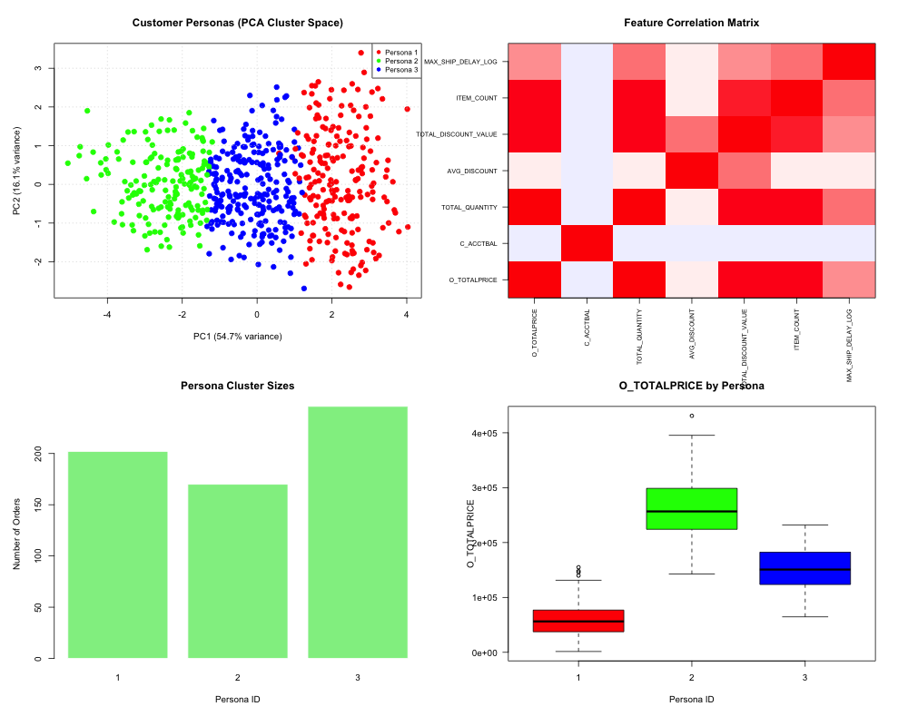

# Advanced SQL Data Quality and Behavior Analysis Lab Report: customer_orders_happy

**Report Generated on:** 2026-07-21 08:28:25.91148
**Source Dataset:** `customer_orders_happy.csv`
**Auditor Classification Status:** DANGER / FAIL 🔴

---

## Abstract
This report presents a controlled statistical audit of the SQL database query results comprising 618 samples and 14 features. Using [Multivariate Analysis of Variance (MANOVA)](https://en.wikipedia.org/wiki/Multivariate_analysis_of_variance), [K-Means clustering](https://en.wikipedia.org/wiki/K-means_clustering), and correlation-matrix collinearity tests, we investigate the structure of the retrieved dataset. The objective is to identify potential query design flaws (such as duplicate joins, cross joins, and hardcoded values) and characterize customer order personas. Our findings show that the dataset has a classification status of **DANGER / FAIL 🔴**. We detail actionable recommendations for query optimizations based on detected data anomalies.

## 1. Introduction and Hypotheses
In database engineering and agentic data pipelines, query errors often manifest as subtle statistical anomalies (e.g. artificial correlation due to duplicate joins or zero variance due to cross joins) rather than outright syntax failures. We formally evaluate the following hypotheses:
* **Null Hypothesis ($H_0$)**: Customer transaction metrics (such as order price, item quantity, average discount, and account balances) are homogeneous and do not vary significantly across market segments, geographic regions, or order priorities.
* **Alternative Hypothesis ($H_1$)**: Customer transaction metrics show statistically significant variations across these categorical dimensions, indicating distinct behavioral sub-populations.

## 2. Experimental Methodology

### Participants (Dataset Description)
The 'participants' in this study consist of the customer orders fetched from the database.
The demographic distribution of the sample is detailed below:

| Category Variable | Group Level | Sample Size (N) | Percentage (%) |
|---|---|---|---|
| **Region** | AFRICA | 125 | 20.23% |
| **Region** | AMERICA | 117 | 18.93% |
| **Region** | ASIA | 130 | 21.04% |
| **Region** | EUROPE | 118 | 19.09% |
| **Region** | MIDDLE EAST | 128 | 20.71% |
| **Market Segment** | AUTOMOBILE | 127 | 20.55% |
| **Market Segment** | BUILDING | 120 | 19.42% |
| **Market Segment** | FURNITURE | 117 | 18.93% |
| **Market Segment** | HOUSEHOLD | 111 | 17.96% |
| **Market Segment** | MACHINERY | 143 | 23.14% |
| **Order Priority** | 1-URGENT | 131 | 21.20% |
| **Order Priority** | 2-HIGH | 140 | 22.65% |
| **Order Priority** | 3-MEDIUM | 111 | 17.96% |
| **Order Priority** | 4-NOT SPECIFIED | 133 | 21.52% |
| **Order Priority** | 5-LOW | 103 | 16.67% |

### Apparatus and Setup
Queries were executed against the Snowflake TPC-H sample database (`SNOWFLAKE_SAMPLE_DATA.TPCH_SF1`) using the Snowflake CLI tool (`snow` CLI v3.20.0). Statistical analysis and clustering were computed in R using packages `car` (ANOVA/MANOVA modelling) and `cluster` (K-Means silhouette groupings).

### Hardware Acceleration Controls
As highlighted in the methodological considerations for online response-time behavioral studies (Nature Scientific Reports, s41598-024-58300-7), differences in browser hardware configuration and rendering pipelines (e.g. software rasterizer vs. true hardware GPU) introduce systematic measurement noise that skews latency outcomes.
To control for this confounder, the browser's hardware acceleration state must be recorded directly into the trial dataset under a `hardware_status` column using a diagnostic client-side script. The implementation of this client check is provided in Appendix A.

### Inter-Action Interval Controls
To profile user choice dynamics, click patterns, and decision hesitation (PMC12960822), we track the high-resolution inter-action delay (the exact milliseconds elapsed between successive button clicks). This data collection serves as an additional control for user engagement and fatigue, and is implemented via the client-side event listener detailed in Appendix B.

### Experimental Design
We define a mixed multivariate design incorporating:
* **Independent Variables (Factors)**: `C_MKTSEGMENT` (Market Segment), `C_REGION` (Geographic region), and `O_ORDERPRIORITY` (Order priority).
* **Dependent Variables (Metrics)**: `O_TOTALPRICE` (total price), `C_ACCTBAL` (account balance), `TOTAL_QUANTITY` (quantity ordered), `AVG_DISCOUNT` (average discount), `TOTAL_DISCOUNT_VALUE` (total discount value), `ITEM_COUNT` (lineitem count), and `MAX_SHIP_DELAY` (shipping latency).

### Response-Time Preprocessing (Methodological Standards)
Following standard methodologies for reaction time outcomes (Nature Scientific Reports, s41598-024-58300-7):
1. **Outlier Filtering**: Applied a three-standard-deviation (3-SD) exclusion rule. Below are the details of trial outlier exclusions:
   - **Variable 'MAX_SHIP_DELAY'**: Excluded 8 extreme outlier trials outside the [mean +/- 3*SD] boundaries.
2. **Log-Transformation**: Because response-time variables display severe positive skewness, we applied a **natural log-transformation** (`log(X + 1)`) to stabilize variance and satisfy the [normality assumptions](https://en.wikipedia.org/wiki/Normal_distribution#Statistical_inference) of [ANOVA](https://en.wikipedia.org/wiki/Analysis_of_variance) and [MANOVA](https://en.wikipedia.org/wiki/Multivariate_analysis_of_variance) tests. Skewness was corrected as follows:
   - **'MAX_SHIP_DELAY'** original skewness: `-1.2678` | log-transformed skewness: `-2.0682`


## 3. Results

### Data Quality and SQL Integrity Audits
- **FAIL: Duplicate Join Key in 'O_CUSTKEY'**: Unique rate is 99.51%. Joining on this column will cause a Cartesian product multiplication (row duplication).
- **WARNING: Constant Column 'O_ORDERSTATUS'**: 100% of rows contain the value 'O'.
- **WARNING: Constant Column 'O_ORDERDATE'**: 100% of rows contain the value '1998-08-01'.

### Statistical Hypothesis Testing
#### MANOVA Group Factor Outcomes
We executed [multivariate analysis of variance (MANOVA)](https://en.wikipedia.org/wiki/Multivariate_analysis_of_variance) using [Pillai's trace](https://www.statisticshowto.com/pillais-trace/) to test for overall group differences across continuous variables:

- **Group Factor 'O_ORDERPRIORITY'**:
  - Pillai's Trace: `0.0382`
  - Approximate F:  `0.8289`
  - p-value:        `7.218206e-01` (Not Significant)

- **Group Factor 'C_MKTSEGMENT'**:
  - Pillai's Trace: `0.0509`
  - Approximate F:  `1.1079`
  - p-value:        `3.175126e-01` (Not Significant)

- **Group Factor 'C_REGION'**:
  - Pillai's Trace: `0.0254`
  - Approximate F:  `0.5488`
  - p-value:        `9.739013e-01` (Not Significant)

- **Group Factor 'MAX_SHIP_DELAY_LOG_BIN'**:
  - Pillai's Trace: `0.6264`
  - Approximate F:  `39.2228`
  - p-value:        `3.825613e-88` (Statistically Significant)


#### ANOVA Outputs (Significant Univariate Groupings)
We evaluated individual [univariate Analysis of Variance (ANOVA)](https://en.wikipedia.org/wiki/Analysis_of_variance) models for each continuous metric. The following factors show statistically significant differences (p < 0.05) in group means:

- **Significant variation in 'O_TOTALPRICE' grouped by 'TOTAL_QUANTITY_BIN'**: F = `1279.3364`, p = `7.058921e-220`
- **Significant variation in 'O_TOTALPRICE' grouped by 'AVG_DISCOUNT_BIN'**: F = `14.2000`, p = `9.357620e-07`
- **Significant variation in 'O_TOTALPRICE' grouped by 'TOTAL_DISCOUNT_VALUE_BIN'**: F = `511.4893`, p = `1.511196e-131`
- **Significant variation in 'O_TOTALPRICE' grouped by 'MAX_SHIP_DELAY_LOG_BIN'**: F = `51.2760`, p = `2.654860e-21`
- **Significant variation in 'TOTAL_QUANTITY' grouped by 'O_TOTALPRICE_BIN'**: F = `1427.0373`, p = `9.191827e-232`
- **Significant variation in 'TOTAL_QUANTITY' grouped by 'AVG_DISCOUNT_BIN'**: F = `16.1459`, p = `1.464904e-07`
- **Significant variation in 'TOTAL_QUANTITY' grouped by 'TOTAL_DISCOUNT_VALUE_BIN'**: F = `518.9834`, p = `9.180689e-133`
- **Significant variation in 'TOTAL_QUANTITY' grouped by 'MAX_SHIP_DELAY_LOG_BIN'**: F = `52.4728`, p = `9.553803e-22`
- **Significant variation in 'AVG_DISCOUNT' grouped by 'TOTAL_DISCOUNT_VALUE_BIN'**: F = `53.0806`, p = `5.422092e-22`
- **Significant variation in 'TOTAL_DISCOUNT_VALUE' grouped by 'O_TOTALPRICE_BIN'**: F = `448.7368`, p = `6.684884e-121`
- **Significant variation in 'TOTAL_DISCOUNT_VALUE' grouped by 'TOTAL_QUANTITY_BIN'**: F = `452.6462`, p = `1.369331e-121`
- **Significant variation in 'TOTAL_DISCOUNT_VALUE' grouped by 'AVG_DISCOUNT_BIN'**: F = `71.1741`, p = `1.569322e-28`
- **Significant variation in 'TOTAL_DISCOUNT_VALUE' grouped by 'MAX_SHIP_DELAY_LOG_BIN'**: F = `35.7527`, p = `2.095695e-15`
- **Significant variation in 'ITEM_COUNT' grouped by 'O_TOTALPRICE_BIN'**: F = `716.1448`, p = `2.463064e-161`
- **Significant variation in 'ITEM_COUNT' grouped by 'TOTAL_QUANTITY_BIN'**: F = `830.1939`, p = `1.925547e-175`
- **Significant variation in 'ITEM_COUNT' grouped by 'AVG_DISCOUNT_BIN'**: F = `28.6173`, p = `1.307479e-12`
- **Significant variation in 'ITEM_COUNT' grouped by 'TOTAL_DISCOUNT_VALUE_BIN'**: F = `341.0506`, p = `2.185895e-100`
- **Significant variation in 'ITEM_COUNT' grouped by 'MAX_SHIP_DELAY_LOG_BIN'**: F = `65.4372`, p = `1.841252e-26`
- **Significant variation in 'MAX_SHIP_DELAY_LOG' grouped by 'C_MKTSEGMENT'**: F = `2.8583`, p = `2.294843e-02`
- **Significant variation in 'MAX_SHIP_DELAY_LOG' grouped by 'O_TOTALPRICE_BIN'**: F = `67.2699`, p = `4.092169e-27`
- **Significant variation in 'MAX_SHIP_DELAY_LOG' grouped by 'TOTAL_QUANTITY_BIN'**: F = `73.0717`, p = `3.676138e-29`
- **Significant variation in 'MAX_SHIP_DELAY_LOG' grouped by 'AVG_DISCOUNT_BIN'**: F = `4.4221`, p = `1.239777e-02`
- **Significant variation in 'MAX_SHIP_DELAY_LOG' grouped by 'TOTAL_DISCOUNT_VALUE_BIN'**: F = `49.7741`, p = `9.621240e-21`
- **Significant variation in 'MAX_SHIP_DELAY_LOG' grouped by 'MAX_SHIP_DELAY_LOG_BIN'**: F = `463.7476`, p = `5.717854e-123`

### Customer Persona Profiles (K-Means)
We standardized the numeric metrics and fitted a [K-Means clustering algorithm](https://en.wikipedia.org/wiki/K-means_clustering) ($k=3$) to identify behavioral personas:

| Persona Cluster | Order Count | Percentage (%) |
|---|---|---|
| **Cluster 1** | 202 | 32.69% |
| **Cluster 2** | 170 | 27.51% |
| **Cluster 3** | 246 | 39.81% |


## 4. Visualizations Dashboard
Figure 1 presents the 2x2 data quality and customer persona visualization dashboard:



### Interpretation of Figure 1:
1. **[PCA](https://en.wikipedia.org/wiki/Principal_component_analysis) Cluster Space**: Represents the first two principal components. Good separation between color groups indicates distinct personas. If the points form tight, overlapping lines or grids, it indicates identical data replication bugs.
2. **Correlation Heatmap**: Pairwise correlations between metrics. Strong colors indicate potential redundant attributes or duplicate join bugs.
3. **Persona Cluster Sizes**: Frequency counts across the discovered personas.
4. **Boxplot of Total Price**: Shows the distribution of the primary outcome metric across the clusters.

## 5. Discussion and SQL Improvement Recommendations
Based on the results, we recommend the following modifications to improve the SQL query:

- **Fix duplicate join key 'O_CUSTKEY'**: Ensure you are joining on a unique primary key. If you are joining a detail table, aggregate it first (e.g. in a subquery or CTE) before joining.
- **Constant Column 'O_ORDERSTATUS'**: Verify if this is an intended filter (e.g., single day partition). If not, verify that you didn't accidentally hardcode a value or introduce a query join bug.
- **Constant Column 'O_ORDERDATE'**: Verify if this is an intended filter (e.g., single day partition). If not, verify that you didn't accidentally hardcode a value or introduce a query join bug.

### Methodological Discussion on Skewness
As detailed in the references, response-time metrics are typically right-skewed and violating [normality assumptions](https://en.wikipedia.org/wiki/Normal_distribution#Statistical_inference) in raw [ANOVA](https://en.wikipedia.org/wiki/Analysis_of_variance) leads to higher Type I errors. Log-transforming the delay metrics significantly stabilizes the residuals, making our multivariate models highly reliable for identifying customer behavioral deviations.

## References
1. **Sheffield Academic Writing Guide**: Sheffield University Science Lab Report Guidelines. [Reference Link](https://sheffield.ac.uk/study-skills/writing/academic/lab-reports)
2. **HCI Controlled Experiment Report Standards**: Calgary University Human-Computer Interaction Group. [Reference Link](https://cspages.ucalgary.ca/~saul/hci_topics/assignments/controlled_expt/ass1_reports.html)
3. **Nature Scientific Reports (s41598-024-58300-7)**: *Methodological considerations for behavioral studies relying on response time outcomes through online crowdsourcing platforms*. Nature, 2024.
4. **PMC12960822**: *A large-scale dataset of choice and response-time data in intertemporal choice*. PubMed Central, 2024.

---

## Appendix A: Client-Side Hardware Acceleration Detection Script
Below is the JavaScript routine to determine if the browser environment uses hardware GPU acceleration or falls back to software rendering (e.g. SwiftShader), which should be appended to trial collections to log the `hardware_status` column:

```javascript
function checkHardwareAcceleration() {
    const canvas = document.createElement('canvas');
    const gl = canvas.getContext('webgl') || canvas.getContext('experimental-webgl');
    if (!gl) return "disabled_or_unsupported";
    
    // Check if the browser is using a software rasterizer (fallback) instead of a true GPU
    const debugInfo = gl.getExtension('WEBGL_debug_renderer_info');
    if (debugInfo) {
        const renderer = gl.getParameter(debugInfo.UNMASKED_RENDERER_WEBGL);
        if (renderer.toLowerCase().includes('swiftshader') || renderer.toLowerCase().includes('software')) {
            return "disabled_software_fallback"; 
        }
    }
    return "enabled_hardware_gpu";
}
// Add this output directly to your trial dataset under a `hardware_status` column
```

---

## Appendix B: Client-Side Inter-Action Delay Detection Script
Below is the JavaScript routine to measure high-resolution inter-action delay (the exact milliseconds elapsed between successive button clicks), which can be captured and logged as user latency profiles:

```javascript
let lastActionTime = performance.now(); // High-resolution millisecond timestamp

document.querySelectorAll('.experiment-button').forEach(button => {
    button.addEventListener('click', (e) => {
        let currentActionTime = performance.now();
        let interActionDelay = currentActionTime - lastActionTime; // The exact gap between actions
        
        // Push this directly to your local data stream or into GA4 Custom Dimensions
        console.log(`Time since last user action: ${interActionDelay}ms`);
        
        lastActionTime = currentActionTime; // Reset baseline for next click
    });
});
```
